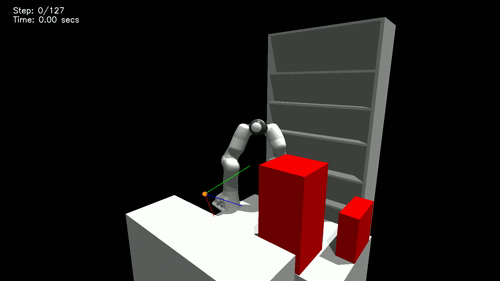

# Motion Planning Diffusion: Learning and Adapting Robot Motion Planning with Diffusion Models

[](https://ieeexplore.ieee.org/abstract/document/11097366)
[](https://arxiv.org/abs/2412.19948)
[](https://sites.google.com/view/motionplanningdiffusion/)
[]()


<div style="display: flex; text-align:center; justify-content: center">
    
    
</div>

This repository implements Motion Planning Diffusion (**MPD**) - a method for learning and planning robot motions with diffusion models.

An older version of this project is deprecated, but still available at [https://github.com/jacarvalho/mpd-public](https://github.com/jacarvalho/mpd-public).

Please contact me if you have any questions -- [joao@robot-learning.de](mailto:joao@robot-learning.de)

---
# Installation

Pre-requisites:
- Ubuntu 22.04 (maybe works with newer versions)
- [miniconda](https://docs.conda.io/projects/miniconda/en/latest/index.html)

Clone this repository
```bash
mkdir -p ~/Projects/MotionPlanningDiffusion/
cd ~/Projects/MotionPlanningDiffusion/
git clone --recurse-submodules git@github.com:joaoamcarvalho/mpd-splines-public.git mpd-splines-public
cd mpd-splines-public
```

Download [IsaacGym Preview 4](https://developer.nvidia.com/isaac-gym) and extract it under `deps/isaacgym`
```bash
mv ~/Downloads/IsaacGym_Preview_4_Package.tar.gz ~/Projects/MotionPlanningDiffusion/mpd-splines-public/deps/
cd ~/Projects/MotionPlanningDiffusion/mpd-splines-public/deps
tar -xvf IsaacGym_Preview_4_Package.tar.gz
```

Run the bash setup script to install everything (it can take a while).
```bash
bash setup.sh
```

Make sure to set environment variables and activate the conda environment before running any scripts.
```bash
source set_env_variables.sh
conda activate mpd-splines-public
```

---
## Download the datasets and pre-trained models

Download https://drive.google.com/file/d/1KG5ejn0g0KkDuUK6tPUqfmRYCNoKzK4K/view?usp=drive_link

```bash
tar -xvf data_public.tar.gz
ln -s data_public/data_trajectories data_trajectories
ln -s data_public/data_trained_models data_trained_models
```


---
## Inference with pre-trained models

The configuration files under [scripts/inference/cfgs](scripts/inference/cfgs) contain the hyperparameters for inference.\
Inside the file `scripts/inference/inference.py` you can change the `cfg_inference_path` parameter to try models trained for different environments.

```bash
cd scripts/inference
python inference.py
```


---
# Training the prior models (from scratch)


## Data generation

Generating data takes a long time, so we recommend [downloading the dataset](#download-the-datasets-and-pre-trained-models).
But if anyway you want to generate your own data, you can do it with the scripts in the `scripts/generate_data` folder.

Go to the `scripts/generate_data` folder.

The base script is
```bash
python generate_trajectories.py
```

To generate multiple datasets in parallel, adapt the `launch_generate_trajectories.py` script.
```bash
python launch_generate_trajectories.py
```

After generating the data, run the post-processing file to combine all data into a hdf5 file.
Then you can double the dataset by flipping the trajectory paths.
```bash
python post_process_trajectories.py --help
python flip_solution_paths.py  (change the PATH_TO_DATASETS variable)
```

To visualize the generated data, use the `visualize_trajectories.py` script.
```bash
python visualize_trajectories.py
```

---
## Training the models

The training scripts are in the `scripts/train` folder.

The base script is
```bash
cd scripts/train
python train.py
```

To train multiple models in parallel, use the `launch_train_*` files.


---
## Citation

If you use our work or code base, please cite our articles:
```latex
@article{carvalho2025motion,
  title={Motion planning diffusion: Learning and adapting robot motion planning with diffusion models},
  author={Carvalho, Jo{\~a}o and Le, An T and Kicki, Piotr and Koert, Dorothea and Peters, Jan},
  journal={IEEE Transactions on Robotics},
  year={2025},
  publisher={IEEE}
}

@inproceedings{carvalho2023motion,
  title={Motion planning diffusion: Learning and planning of robot motions with diffusion models},
  author={Carvalho, Jo{\~a}o and Le, An T and Baierl, Mark and Koert, Dorothea and Peters, Jan},
  booktitle={IEEE/RSJ International Conference on Intelligent Robots and Systems (IROS)},
  year={2023}
}
```


---
## SDEdit-Style Path Regeneration

This extension adds **SDEdit-style path editing** to MPD — instead of generating trajectories from pure noise, you can start from an existing path, add noise to an intermediate diffusion timestep, and denoise to produce new collision-free trajectories. This is useful for two scenarios:

1. **Re-planning**: You have a valid path, then the obstacle map changes slightly (add/remove an obstacle). Rather than planning from scratch, you noise the old path and denoise under the updated cost guide.
2. **Sketch-to-path**: You have an approximate or illegal "sketch" of a desired path. You noise it and denoise to produce a legal, collision-free version that preserves the sketch's characteristics.

### Quick Start

```bash
source set_env_variables.sh
conda activate mpd-splines-public
cd scripts/inference
python inference_sdedit.py
```

To sweep multiple noise levels:
```bash
python inference_sdedit.py --t_noise_levels "3,5,7,9,11"
```

### New Files Reference

#### `scripts/inference/inference_sdedit.py` — Main SDEdit Inference Script

The primary entry point for running SDEdit experiments. Supports both re-planning and sketch modes.

**Key arguments** (passed via CLI or YAML config):

| Argument | Type | Default | Description |
|---|---|---|---|
| `cfg_inference_path` | str | `./cfgs/config_..._sdedit.yaml` | Path to the SDEdit YAML configuration |
| `t_noise_levels` | str | `"7"` | Comma-separated DDIM step indices to test (e.g., `"3,5,7,9,11"`) |
| `sdedit_mode` | str | `"replan"` | `"replan"` (modify obstacles + regenerate) or `"sketch"` (denoise illegal path) |
| `n_start_goal_states` | int | `3` | Number of start/goal pairs to evaluate |
| `selection_start_goal` | str | `"validation"` | Source for start/goal states (`"training"` or `"validation"`) |
| `render_before_after` | bool | `True` | Generate 3-panel Before / Obstacle Edit / After figure (`.png`) |
| `render_denoising_video` | bool | `True` | Generate denoising animation video (`.mp4`) showing progressive SDEdit refinement |
| `render_env_robot_opt_iters` | bool | `True` | Use existing MPD rendering for denoising iteration frames |
| `results_dir` | str | `"logs_sdedit"` | Directory for output results, plots, and videos |

**Pipeline**:
1. Loads model, environment, and dataset (same setup as standard `inference.py`)
2. Optionally modifies the obstacle map (for re-planning mode)
3. Generates a reference path using RRTConnect
4. Runs SDEdit at each specified noise level: noises the path → denoises with cost guidance
5. Saves results (`.pt`), renders comparison plots (`.png`), and denoising videos (`.mp4`)

**Output files per sample** (in `results_dir/`):
| File | Generated by |
|---|---|
| `sdedit_before_after-{idx}.png` | 3-panel Before/Edit/After figure (`render_before_after`) |
| `sdedit_denoising-{idx}.mp4` | Denoising animation video (`render_denoising_video`) |
| `sdedit_result-{idx}.png` | Single-panel result (when 1 noise level) |
| `sdedit_comparison-{idx}.png` | Multi-noise-level comparison (when >1 noise levels) |
| `results_sdedit-{idx}-noise{t}.pt` | Serialized results per noise level |

**Example — Re-planning with a new obstacle**:
```bash
python inference_sdedit.py \
  --sdedit_mode replan \
  --t_noise_levels "5,7,9" \
  --n_start_goal_states 5
```

**Example — Sketch mode (denoise an illegal path)**:
```bash
python inference_sdedit.py --sdedit_mode sketch --t_noise_levels "7"
```

---

#### `scripts/inference/cfgs/config_EnvSimple2D-RobotPointMass2D_sdedit.yaml` — SDEdit Configuration

YAML configuration file extending the standard 2D PointMass config with SDEdit-specific parameters.

**SDEdit-specific section**:
```yaml
sdedit:
  t_noise_level: 7          # Default DDIM step to noise to (0=full noise, 14=barely noised)
  mode: 'replan'             # 'replan' or 'sketch'
  obstacle_modification:     # Only used in replan mode
    type: 'add_sphere'       # 'add_sphere', 'remove_sphere', or 'add_box'
    center: [0.0, 0.0]       # Center of the new obstacle
    radius: 0.15             # Radius (for spheres)
```

**Key tuning parameters**:
- `ddim.ddim_eta`: Controls stochasticity during denoising. Lower values (e.g., `0.3`) keep outputs closer to the input path. Higher values (e.g., `0.5`–`1.0`) produce more diversity.
- `ddim.ddim_sampling_timesteps`: Total DDIM steps (default `15`). The `t_noise_level` is an index into this schedule.
- `planner_alg`: Should be `'mpd'` for SDEdit to leverage cost guidance for collision avoidance with new obstacles.

---

#### `mpd/utils/path_conversion.py` — Path to Control Points Conversion

Converts a raw waypoint path into normalized B-spline control points that the diffusion model can process.

**Function**: `path_to_normalized_control_points(path, parametric_trajectory, dataset, tensor_args=None)`

| Parameter | Type | Description |
|---|---|---|
| `path` | ndarray or Tensor `(N, state_dim)` | Waypoint path to convert |
| `parametric_trajectory` | `ParametricTrajectoryBspline` | From `planning_task.parametric_trajectory` |
| `dataset` | `TrajectoryDatasetBspline` | Provides normalization statistics |
| `tensor_args` | dict | `{"device": ..., "dtype": ...}` |

**Returns**: `(n_learnable_control_points, state_dim)` normalized tensor in `[-1, 1]`.

**Usage**:
```python
from mpd.utils.path_conversion import path_to_normalized_control_points

# path is (N, 2) numpy array of waypoints
cps_normalized = path_to_normalized_control_points(
    path,
    planning_task.parametric_trajectory,
    dataset,
    tensor_args={"device": "cuda:0", "dtype": torch.float32},
)
```

---

#### `mpd/utils/obstacle_editing.py` — Dynamic Obstacle Modification

Utilities for adding/removing obstacles from the environment at runtime, enabling re-planning scenarios without reloading.

**Functions**:

| Function | Description |
|---|---|
| `add_sphere_obstacle(env, center, radius, tensor_args)` | Add a sphere to the environment and recompute SDF. Returns the `ObjectField` for later removal. |
| `add_box_obstacle(env, center, sizes, tensor_args)` | Add a box obstacle. `sizes` are half-extents. |
| `remove_extra_obstacles(env)` | Remove all dynamically added obstacles and recompute SDF. |
| `remove_fixed_obstacle_by_index(env, obstacle_idx, tensor_args)` | Remove a fixed obstacle by its index within the `MultiSphereField`. Use with caution. |

**Usage**:
```python
from mpd.utils.obstacle_editing import add_sphere_obstacle, remove_extra_obstacles

# Add a new obstacle
obj = add_sphere_obstacle(planning_task.env, center=[0.3, -0.2], radius=0.1, tensor_args=tensor_args)

# ... run SDEdit planning ...

# Clean up
remove_extra_obstacles(planning_task.env)
```

**Important**: After modifying obstacles, you must rebuild the cost guide so it sees the updated SDF:
```python
from mpd.inference.cost_guides import CostGuideManagerParametricTrajectory
planner.cost_guide = CostGuideManagerParametricTrajectory(planning_task, dataset, args_inference, tensor_args)
```

---

#### `mpd/plotting/sdedit_plots.py` — SDEdit Visualization

Plotting utilities for visualizing SDEdit results.

**Functions**:

| Function | Description |
|---|---|
| `plot_sdedit_results(env, q_pos_start, q_pos_goal, input_path, regenerated_paths, ...)` | Single plot showing input path (blue), regenerated paths (orange), best path (green), obstacles, and optional added obstacle annotation. |
| `plot_noise_level_comparison(env, q_pos_start, q_pos_goal, input_path, results_by_noise_level, ...)` | Side-by-side comparison of SDEdit outputs at different noise levels. |
| `plot_sdedit_before_after(planning_task, q_pos_start, q_pos_goal, input_path, best_regen_path, ...)` | **3-panel figure** — Before (original obstacles + valid path), Obstacle Edit (modified map), After (modified obstacles + regenerated path). Uses `env.render(ax)` and `planning_task` infrastructure. |
| `animate_sdedit_denoising(planning_task, q_pos_start, q_pos_goal, input_path, trajs_pos_iters, ...)` | **MP4 video** of the SDEdit denoising process — shows progressive trajectory refinement frame-by-frame with collision coloring (valid=green, colliding=red), input path overlay (dashed blue), and start/goal markers. |

All functions accept a `save_path` (or `video_filepath` for animations) argument to save output to disk.

**Usage — 3-panel Before/After figure**:
```python
from mpd.plotting.sdedit_plots import plot_sdedit_before_after

fig, axes = plot_sdedit_before_after(
    planning_task,
    q_pos_start, q_pos_goal,
    input_path,                        # (N, 2) original waypoints
    best_regen_path=best_path,         # (N, 2) best collision-free path
    all_regen_paths=all_paths,         # (n_samples, N, 2) all SDEdit outputs (optional)
    obstacle_modification={"type": "add_sphere", "center": [0, 0], "radius": 0.15},
    title="Re-planning after obstacle added",
    save_path="results/before_after.png",
)
```

**Usage — Denoising animation video**:
```python
from mpd.plotting.sdedit_plots import animate_sdedit_denoising

animate_sdedit_denoising(
    planning_task,
    q_pos_start, q_pos_goal,
    input_path,                        # (N, 2) original waypoints (shown as overlay)
    trajs_pos_iters=q_trajs_pos_iters, # list of (n_samples, N, 2) at each denoising step
    traj_pos_best=best_path,           # (N, 2) final best path (shown in last frame)
    video_filepath="results/sdedit_denoising.mp4",
    anim_time=5.0,                     # seconds for the animation
)
```

**Usage — Single-panel result**:
```python
from mpd.plotting.sdedit_plots import plot_sdedit_results

fig, ax = plot_sdedit_results(
    planning_task.env,
    q_pos_start, q_pos_goal,
    input_path,                    # (N, 2) original waypoints
    regenerated_paths,             # (n_samples, N, 2) SDEdit outputs
    best_path=best_path,           # (N, 2) best collision-free path
    title="Re-planning after obstacle added",
    obstacle_modification={"type": "add_sphere", "center": [0, 0], "radius": 0.15},
    save_path="results/sdedit_example.png",
)
```

---

### SDEdit Core Methods (for developers)

The following methods were added to `GaussianDiffusionModel` in `mpd/models/diffusion_models/diffusion_model_base.py`:

| Method | Description |
|---|---|
| `ddim_sdedit_sample_loop(x_start, t_noise_level, ...)` | DDIM SDEdit: forward-noises `x_start` to the diffusion timestep corresponding to DDIM step `t_noise_level`, then denoises through the remaining DDIM steps with full guidance support. |
| `p_sdedit_sample_loop(x_start, t_noise_level, ...)` | DDPM SDEdit: forward-noises to step `t_noise_level`, then runs the standard DDPM reverse loop from there. |
| `conditional_sample_sdedit(x_start, t_noise_level, ...)` | Dispatcher that routes to DDIM or DDPM SDEdit based on `method` argument. |
| `run_sdedit_inference(x_start, t_noise_level, ...)` | High-level wrapper: handles batching `x_start` for `n_samples`, repeating context/hard_conds, and rearranging output chains. |

The `GenerativeOptimizationPlanner` in `mpd/inference/inference.py` gained:

| Method | Description |
|---|---|
| `plan_trajectory_sdedit(q_pos_start, q_pos_goal, EE_pose_goal, input_path, t_noise_level, ...)` | Full SDEdit planning pipeline: converts `input_path` waypoints to normalized control points, runs SDEdit inference with cost guidance, post-processes to trajectories, filters valid results, and selects the best. |


---
## Credits

Parts of this work and software were taken and/or inspired from:
- [https://github.com/jannerm/diffuser](https://github.com/jannerm/diffuser)
